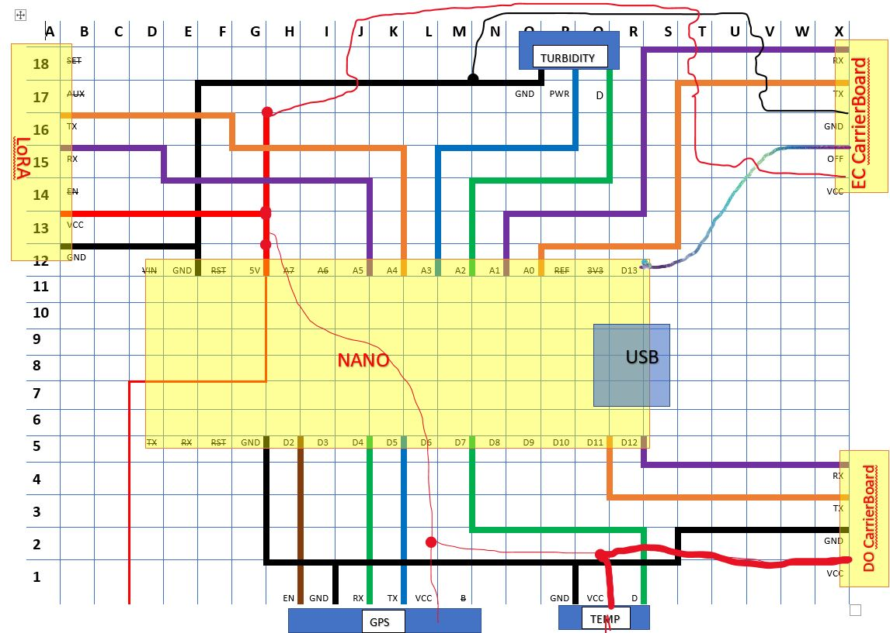
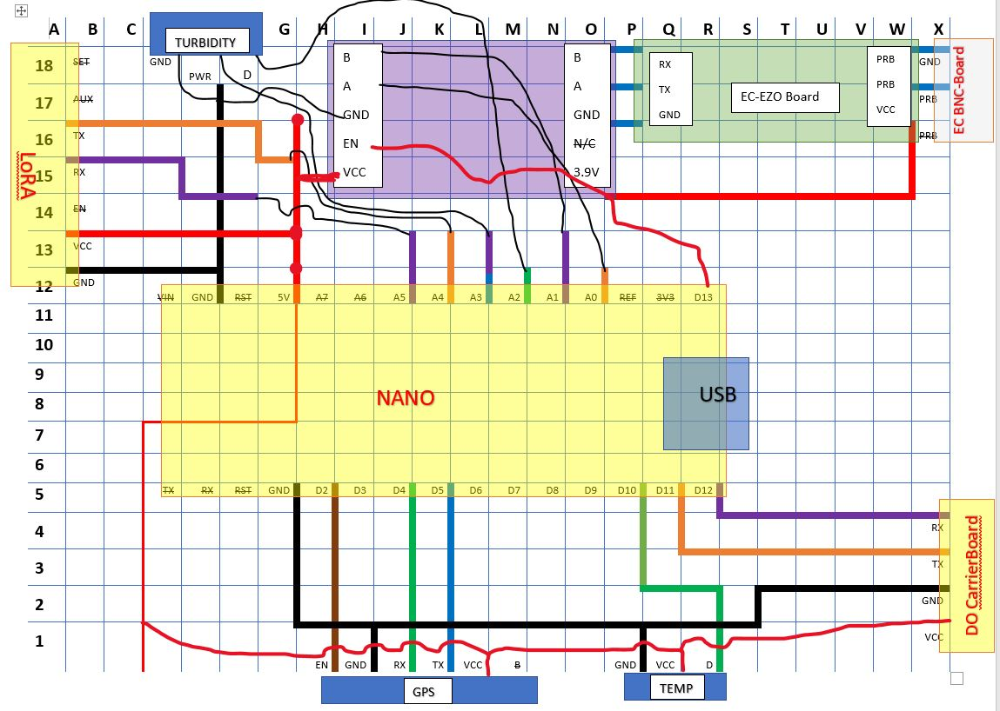
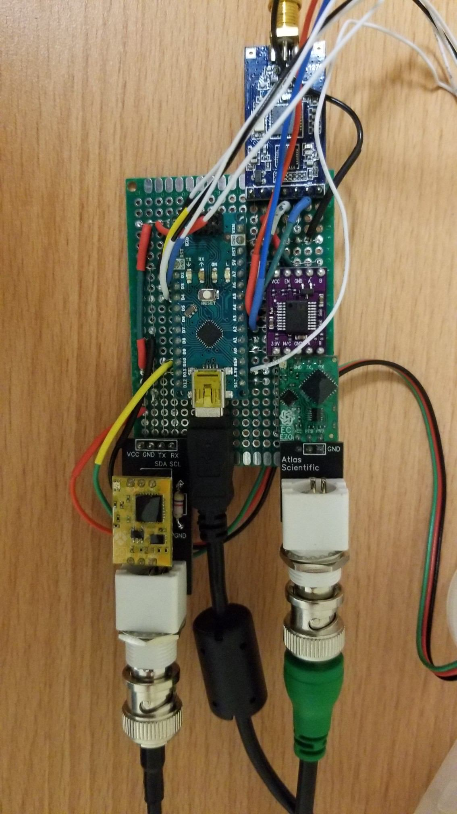
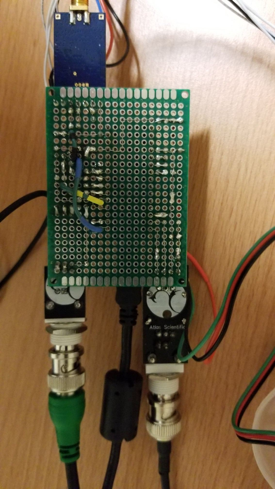

This article assumes some knowledge of soldering and of electrical pin connections on all modules. 
To order the correct products, please read the article [here](https://gitlab.cas.mcmaster.ca/re-mote/arduino-motes/blob/master/Documentation/Setup/Water_Quality_Setup.md) and read the 'The Hardware You Need' section. These parts will be needed to accomplish the assembly task. 

Aside from LoRA, Arduino Nano, Turbidity, Temperature, GPS, EC and DO sensors, you will need the following items as well:

- Soldering Iron and wire

- [Protoboard](https://www.amazon.ca/Prototype-Soldering-Universal-Printed-Electronic/dp/B07F7WBY7Y/ref=sr_1_1?keywords=50+Pcs+Double+Sided+PCB+Board+Prototype+Kit+Soldering+5+Sizes%2C+Universal+Printed+Circuit+Board+for+DIY+and+Electronic+Project&qid=1561752898&s=hi&sr=1-1) - chips from all the modules will be mounted on this board

- Extension Cables - [30m](https://www.amazon.ca/iCreating-100ft-Extension-Changing-Flexible/dp/B07BJJK863/ref=sr_1_1_sspa?keywords=3+cable+pins+extension+cord&qid=1565811677&s=kitchen&sr=1-1-spons&psc=1&spLa=ZW5jcnlwdGVkUXVhbGlmaWVyPUEyQzJENlpNMkQ0UFNCJmVuY3J5cHRlZElkPUEwMzAxNzk1MldKQ0hFUTlESU1MMSZlbmNyeXB0ZWRBZElkPUEwOTU4NzQ1MVFGVllLM0lYU0tYVyZ3aWRnZXROYW1lPXNwX2F0ZiZhY3Rpb249Y2xpY2tSZWRpcmVjdCZkb05vdExvZ0NsaWNrPXRydWU=), [10m](https://www.amazon.ca/JACKYLED-Extension-32-8ft-Splitter-connectors/dp/B075YG2B18/ref=pd_sbs_107_5/154-2633804-7590013?_encoding=UTF8&pd_rd_i=B075YG2B18&pd_rd_r=53c70ff6-961d-4914-8689-a62aaece5d66&pd_rd_w=173ag&pd_rd_wg=5qHDi&pf_rd_p=5dcda75b-8643-4da3-9bb1-5c0233790500&pf_rd_r=9M1SQYYH0Z4JRXS7B4DG&psc=1&refRID=9M1SQYYH0Z4JRXS7B4DG=) (Based on your requirement)

- [Wrapping Wire](https://www.amazon.ca/Breadboard-B-30-1000-Plated-Copper-Wrapping/dp/B008AGUAII/ref=asc_df_B008AGUAII/?tag=googleshopc0c-20&linkCode=df0&hvadid=335174690103&hvpos=1o6&hvnetw=g&hvrand=12611580164319843966&hvpone=&hvptwo=&hvqmt=&hvdev=c&hvdvcmdl=&hvlocint=&hvlocphy=9000871&hvtargid=pla-421501630000&psc=1)

- [Screws](https://www.homedepot.ca/product/paulin-8-32x1-4-ss-pan-phillips-mach-screw/1000423510) to bolt together the lid and box parts, size approximately between 3mm to 4mm

- [Rubber Gel](https://www.canadiantire.ca/en/pdp/the-right-stuff-instant-gasket-maker-for-domestics-0382505p.html#srp)/Silicon to seal the gaps and surfaces for weatherproofing the enclosure

- Other optional accessories: [Wire Management Clamps](https://www.homedepot.ca/product/gardner-bender-3-8-x-1-4-inch-one-hole-plastic-cable-clamp-18-pack-/1000104384), [Clamps](https://www.canadiantire.ca/en/pdp/dundas-jafine-metal-worm-gear-clamp-4-in-0642957p.html#srp), [Electrical Tape](https://www.homedepot.ca/product/commercial-electric-1-2-inch-x-20-ft-vinyl-electrical-tape-multi-coloured-6-pack-/1001098924) 

  

  The following two pictures display the connections between Arduino Nano and all the sensors. The only difference between the two images is the type of EC sensor. First picture shows a simplified version of EC sensor Carrier-Board, while the second one has two additional boards to perform the same functionality (this is because, this EC sensor is an older version). 

  

  Detailed explanation of pin connections on these two images is given in the later part of this article. 

**Image#1** (Simple Version):

**Image#2:** (Pictures are shown at the end of this article)

#### Breakdown of all the connections:

In the following description, the alpha-numeric code in square-brackets is referring to the proto-boards row and column respectively (look at the gridlines of the circuit). To distinguish it from rest of the text, its' been italicized. 

**KEY POINTS TO REMEMBER (Always refer to Image #1):**  

- All the modules have a power pin (commonly known as Vcc) and a ground pin (GND).

- Vcc pin of all the modules must be connected to the 5V pin of Arduino Nano. Best practice is to lay an extension of 5V[*G11*] pin of Arduino Nano (as shown in the images, in red color) using wrapping wire. 

  Since Arduino Nano has only one 5V pin on the board, the 5V terminal of Arduino Nano is extended both upwards and downwards to minimize complexity and good wire network on the board.

  Before connecting any sensors to the 5V supply from the Arduino, please make sure that the sensors can operate at 5V input supply. This can be easily confirmed from the datasheet of the product.

- Similarly, extend the GNDs[*E11* & *G5*] of Arduino Nano (Nano offers 2 GND pins).

- Image#1 is a good depiction of the actual wire set-up, it may help you avoid mistakes if you follow the same pattern. Try to use the proto-boards surface as much as possible with the help of wrapping wire. If not possible, use insulated wire to make the connections. 

- For all of the modules except Turbidity sensor, pins such as Rx(Receiving), Tx(Transmitting), and En(Enable) or OFF can be connected to either analog or digital input/output pins of Arduino. This is because Arduino's analog pins can be easily configured and used as digital I/O pins. **DO NOT USE A6 and A7 AS DIGITAL I/O OF ANY SENSOR**. A6 and A7 are only designed to be used as analog pins.

  In this project, Turbidity sensor is transceiving signals in analog form. Please remember to only connect the turbidity sensors Data pin to an analog pin of Arduino.

- After you have finished connecting all the pins as discussed below, please keep in mind that you are required to switch the Rx and Tx pins of all the sensors (except temperature and turbidity sensors) in the software.

- In the software, Arduino's digital I/O pins can be assigned by using their pin numbers and Arduino Nano has 13 digital I/O pins. In case analog pins are needed to function as digital I/O pins, use the following numbers:

  | Analog Pins | Designated Number for the Software |
  | ----------- | ---------------------------------- |
  | A0          | 14                                 |
  | A1          | 15                                 |
  | A2          | 16                                 |
  | A3          | 17                                 |
  | A4          | 18                                 |
  | A5          | 19                                 |

  

- Image#2 is almost identical to Image#1, aside from the fact that EC sensor requires three boards to achieve same outcome. Please feel free to walk through the design of Image#2, however for the sake of convenience, Image#1 will be used in this article.

**LoRA:**

- Total 7 pins on the chip: Used Tx, Rx, Vcc and GND <u>(IGNORE SET, AUX and EN pins)</u>.
- As explained earlier, connect the Vcc[*A13*] of LoRA with the 5V[*G11*] of Arduino Nano at [*G13*]. Secondly, GND[*A12*] of LoRA with GND[*E11*] of Arduino Nano at [*E12*]
- Connect LoRA Tx[*A16*] with Arduino A4[*K11*]
- Connect LoRA Rx[*A15*] with Arduino A5[*J11*]

**Electrical Conductivity (EC) Sensor:**

- Connect EC-Vcc[*X14*] to Arduino-5V[*G16*]
- Connect EC-GND[*X16*] to Arduino-GND[*M17*]
- Connect EC-OFF[*X15*] to Arduino-D13[*R11*]
- Connect EC-Rx[*X18*] to Arduino-A1[*N11*]
- Connect EC-Tx[*X17*] to Arduino-A0[*O11*]

**Dissolved Oxygen (DO) Sensor:**

- Connect DO-Vcc[*X1*] to Arduino-5V[*L2*]
- Connect DO-GND[*X2*] to Arduino-GND[*S1*]
- Connect DO-Tx[*X3*] to Arduino-D11[*Q5*]
- Connect DO-Rx[*X4*] to Arduino-D12[*R5*]

**GPS:**

- Connect GPS-Vcc to Arduino-5V[*L2*]
- Connect GPS-GND to Arduino-GND[*I1*]
- Connect GPS-EN to Arduino-D2[*H5*]
- Connect GPS-Rx to Arduino-D4[*J5*]
- Connect GPS-Tx to Arduino-D5[*K5*]

**Turbidity Sensor:**

- Connect Turbidity-PWR[*P17*] to Arduino-A3[*L11*]
- Connect Turbidity-GND[*O17*] to Arduino-GND[*E11*]
- Connect Turbidity-D[*Q17*] to Arduino-A2[*M11*]

Important Note: Turbidity's Data pin needs Analog connection to the Arduino.

**Temperature Sensor:**

- Connect Temperature-Vcc to Arduino-5V[*L2*]
- Connect Temperature-GND to Arduino-GND[*P1*]
- Connect Temperature-D to Arduino-D7[*M5*]

------

###### Troubleshooting:

- Check all the pin connections with a multimeter before proceeding to the next steps. Toggle to the connectivity settings on the multimeter and check if two points (if expected) are connected together (the resistance should be negligible and the multimeter will beep, if it has beeping feature)
- Another way of testing the set-up is to check the voltage drop between two points, for example, voltage at Vcc of any sensor with respect to ground should be 5V and the same goes for any Rx and Tx pins. 

If your set-up is failing, its better to check the connections thoroughly, and test if one pin is not connected to two terminals on the other end. Connectivity test will only notify if the connection is good or not, it is up to you to verify that the terminal is not connected to any additional adjacent pin by mistake.  

- For maintenance checks, try not to fix the Arduino Nano to the protoboard as it might be extremely difficult to undo the soldering connections. 

  After properly verifying the set-up, you should solder the Arduino board to the proto-board.
  
  

------

###### Images:

Complicated Node's Top-Side:

Complicated Node's Bottom-Side:

  
  
  