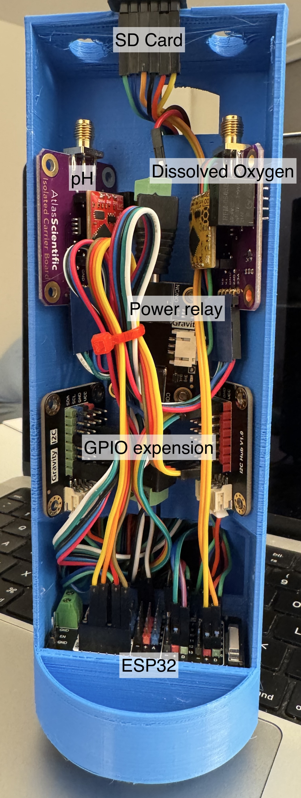

# 3D Printing - Water Sensor Components Enclosure

## Overview

This document explains how to 3D print Water Sensor Components Enclosure by Anycubic Kobra (Other 3D printers may needs to use different profiles).

If you do not want to modify the enclosure model, skip to part 5.

## Preparation

- Anycubic Kobra or any 3D printer
- PETG Filament

## 1. Download Shapr3D

[Shapr3D](https://www.shapr3d.com)

Shapr3D's [educational license](hhttps://www.shapr3d.com/education) is free for students, teachers and faculty members of accredited educational institutions. The license is valid for one year (365 days) and can be renewed once it expires. 

## 2. Open project in Shapr3D

Open `.shapr` project file

Select `File` - `Export` - Choose `.stl` format- Click`Export`

## 3. Download and config Cura slicing software

#### Download

[Cura](https://github.com/Ultimaker/Cura/releases)

#### Config

Open Cura installation Folder

Windows version default location: `C:\Program Files\Ultimaker Cura <version>`

- Version 4.x
  Copy the folder `~/Printer Profile/resources` into the installation folder `Ultimaker Cura <version>/resources`

- Version 5.x
  Copy the folder `~/Printer_Profile/resources` into the installation folder `Ultimaker Cura <version>/share/cura/resources`

Open Cura and choose `Anycubic Kobra` printer with `Generic PETG` Filament

Click `Preferences` on the top bar, select `Configure Cura...`

Click on `Profiles`, then import `Printing_Profile/krunk.curaprofile`

## 4. Slice the model

Click `open` on the top left corner and select the stl file we generated in Inventor.

Align the models, and make sure there is some space between them.

Select the profile we just imported

Click `slice` then `Save to file`

## 5. Copy gcode to SD card

Once sliced the model, a gcode file will be generated.

If you are not updating the model, use the `.gcode` file under `./WS_Enclosure` folder

Copy the file into a MicroSD card

## 6. Start printing

[Kobra Manual](Turtle_Tracker/Docs/3D_Printed_Enclosure/Kobra_Manual/User%20Manual/Anycubic%20Kobra_User%20Manual_20211227_V0.0.1.pdf)

- Leveling: page 25 - 27
- Loading Filament: page 28 - 31
- Printing Models: page 32

