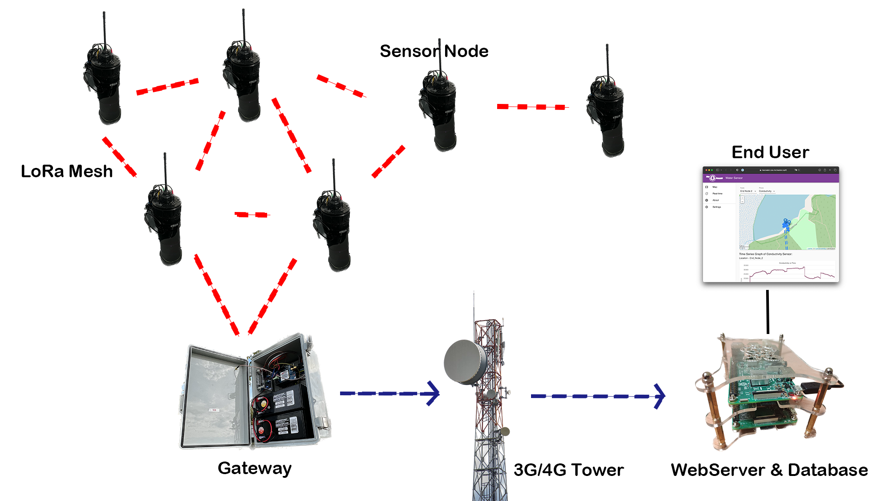

    <h1>re:mote</h1>
    
Open-source Low-cost Software and Hardware Infrastructure for Remote Sensing

## 📎 Table of Contents

1. [About re:mote](#-about-remote)
2. [LoRa & Mesh Network](#-lora-mesh-network)
3. [Setup](#-get-started)
    - [Water Quality Sensing](#water-quality-sensing)
    - [Turtle Trackers](#turtle-trackers)
4. [Documentation](#-documentation)
5. [Acknowledgement](#-acknowledgement)

## 📒 About re:mote

### Low-cost Water Quality Sensing and Turtle Tracking

This is a software and hardware infrastructure for long-term monitoring of water quality parameters and seasonal monitoring of turtle movements that normally cost a lot more to make, but you can do it by yourself at a fraction of the price compared to commercial products.

    
    
Working Water Sensor / Turtle Tracker

---

### Arduino-based motes

- Can be configure with different sensors and different forms.
    - Different network options.
    - Different sensors.
    - Different enclosure.
- Low power cunsumption and can be deployed to remote areas.

The network consists of:
- **Gateway** (one or multiple) to relay end-node data to the server over the
internet using a 3G connection.
- **End Nodes** (one or multiple) to measure water quality parameters through attached sensors.
    - **pH** sensor shows the acidity or alkalinity, helping to detect imbalances.
    - **Conductivity** sensor reveals the amount of salts present, providing insight into water quality.
    - **Dissolved Oxygen** sensor measures oxygen levels in the water, indicating the health of aquatic life.
    - **Water Temperature** sensor helps calibrate all sensor levels.
    - **Turbidity** sensor indicates water clarity, with changes signalling potential disturbances.
    - **[Custom sensors](Documentation/Software/Custom_Sensors.md)**

### Raspberry Pi Server

Used for real-time monitoring, the Raspberry Pi is inexpensive and can also use a regular PC.

A server programmed in Go for fast and concurrent connections.
- A progressive web application designed in React with a custom API.
    - Progressive web application allows you to browse your data on your phone.
    - Custom API makes it easily integrate with other systems.
- A time-series database (InfluxDB) for simple data storage and a smaller footprint. Time series databases assume that insertions are more frequent than queries, so it allows for the fast insertion of large amounts of data, such as water quality data. [Learn More](https://gitlab.cas.mcmaster.ca/re-mote/publications/-/tree/master/FadhelSekerinskiYao18Timeseries)

## 🛰 LoRa & Mesh Network

### Low-power Long-range Sensor Network

A LoRa mesh network is optionally used for connecting motes (nodes can operate standalone).
- It is a low-bandwidth, low-power, and long-range network.
- The mesh network is tolerant to faults, changing network topology, extension, and contraction.

    

## 🚀 Get started

This list will guide you step by step to get started.

---

### Setup [Water Quality Sensing](Water_Sensor/)

1. Get all the [hardwares](Documentation/Water_Sensor/Specification.md) you need.

2. Setup a water sensor server with one of the options below.
    - Install water sensor server on [Docker](https://gitlab.cas.mcmaster.ca/re-mote/pi-server/-/blob/master/macwater-webserver/README.md). **(Recommend)**
    - Install water sensor server on [Linux](https://gitlab.cas.mcmaster.ca/re-mote/pi-server/blob/master/Documentation/RaspberryPi_Instructions.md).
    - Install water sensor server on a [cloud service](https://gitlab.cas.mcmaster.ca/re-mote/publications/tree/master/HuangMengqi19Encryption&Storage).

3. Assembly of Hardware for the [SensorNodes and/or Gateways](Documentation/Water_Sensor/Build_a_Water_Sensor_Portal.md).

4. [Configuring, Testing and Deploying](Documentation/Setup/Water_Quality_Setup.md#configuring-and-uploading-the-software).

---

### Setup [Turtle Trackers](Turtle_Trackers/)

1. Get all the [hardwares](Turtle_Trackers/Docs/Specification.md) you need.

2. Setup a water sensor server with one of the options below.
    - Install water sensor server on [Linux](https://gitlab.cas.mcmaster.ca/re-mote/pi-server/blob/master/Documentation/RaspberryPi_Instructions.md) with the [source code](https://gitlab.cas.mcmaster.ca/re-mote/pi-server/-/tree/master/turtle-tracker-webserver).
    - Install turtle tracker server on a [cloud service](https://gitlab.cas.mcmaster.ca/re-mote/publications/tree/master/HuangMengqi19Encryption&Storage).

3. Assemble Hardware and Flash the Firmware for [Tracker](Turtle_Trackers/Docs/Assembly_of_Trackers.md) and [Gateway](Turtle_Trackers/Docs/Assembly_of_Gateway.md).

---

### Get help

1. If you have questions, post an issue [here](https://github.com/re-mote-sensing/arduino-motes/issues)

## 🗂 Documentation

 - Water Sensor
    - End Node & Gateway
        - [LoRa Message Format](Documentation/Software/Message_Formats.md)
        - [Saved Data Formats](Documentation/Software/Saved_Data_Formats.md)
        - [Add Custom Sensors](Documentation/Software/Custom_Sensors.md)
    - Pi Server
        - [REST Api](https://documenter.getpostman.com/view/5847961/2s83tDpshb)
        - [Database Format](https://gitlab.cas.mcmaster.ca/re-mote/pi-server/-/blob/master/Documentation/Database_Format.md)
        - [Jupyter Notebook scripts](https://gitlab.cas.mcmaster.ca/re-mote/pi-server/-/tree/master/Usefull%20Scripts) for downloading and uploading data to server
 - Turtle Tracker
    - End Node & Gateway
        - [LoRa Message Format](Turtle_Trackers/Docs/message_format_turtle_tracker.xlsx)

## 🏆 Acknowledgment

[McMaster University](https://www.mcmaster.ca)

[Global Water Futures](https://gwf.usask.ca)

[MacWater](http://www.macwater.org)

[Ontario Research Fund](https://www.ontario.ca/page/ontario-research-fund)
