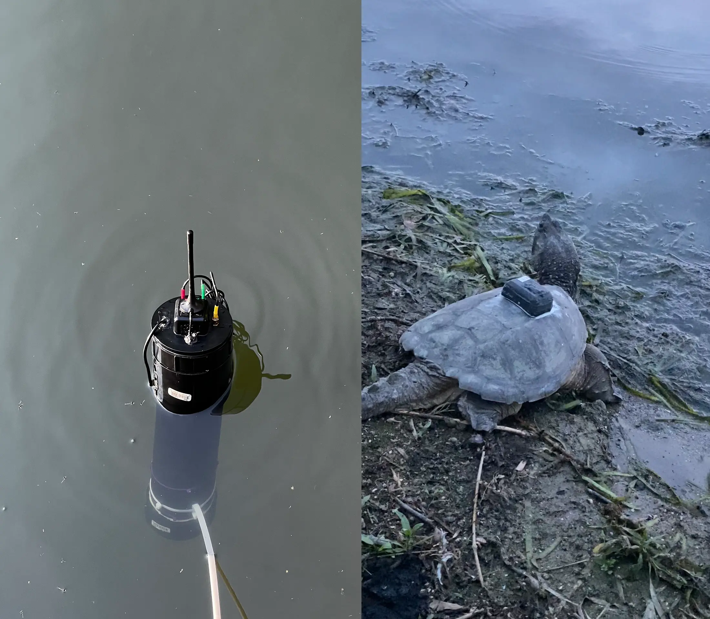
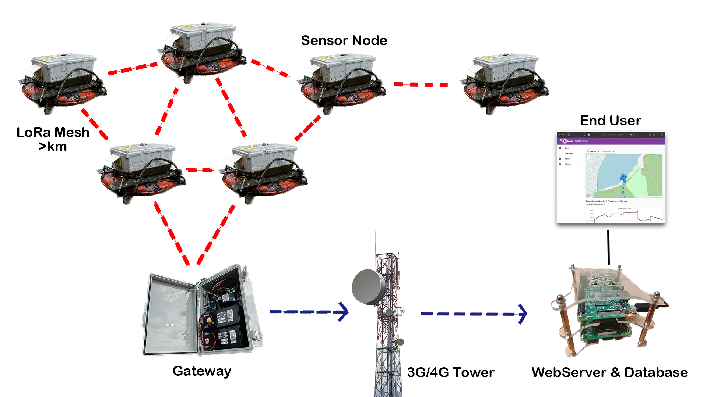

    <h1>re:mote</h1>
    
Open-source Low-cost Software and Hardware Infrastructure for Remote Sensing

## 📎 Table of Contents

1. [About re:mote](#-about-remote)
2. [LoRa & Mesh Network](#-lora-mesh-network)
3. [Setup](#-get-started)
    - [Water Quality Sensing](#water-quality-sensing)
    - [Turtle Trackers](#turtle-trackers)
3. [Documentations](#-documentations)

## 📒 About re:mote

### Low-cost Water Quality Sensing and Turtle Tracking

The goal is to develop with project partners software and hardware infrastructure for long-term monitoring of water quality parameters and seasonal monitoring of turtle movements.

    
    
Working Water Sensor / Turtle Tracker

---

### Arduino-based motes

- Software correctness is a must
- Unreliable communication, changing network topology, long distances
- Limited power supply: low-frequency processors, low-power modes

The network consists of Arduino-based motes:
- Gateway to relay end-node data to the server over the
internet using a 3G connection.
- End nodes to measure water quality parameters through connected sensors.

### Raspberry Pi Server

- Large amounts of simply-structured data
- Erroneous data with “real” anomalies
- Visualization and further programmatic analysis

A server programmed in Go for fast and concurrent connections.
- A progressive web application designed in React with a custom API.
- A time-series database (InfluxDB) for simple data storage and a smaller footprint. Time series databases assume insertions are more frequent than queries, so it allows for the fast insertion of large amounts of data such as water quality data. [Learn More](https://gitlab.cas.mcmaster.ca/re-mote/publications/-/tree/master/FadhelSekerinskiYao18Timeseries)

## 🛰 LoRa & Mesh Network

### Low-power Long-range Sensor Network

A LoRa mesh network is used for connecting motes.
- It is a low-bandwidth, low-power and long-range network.
- The mesh network is tolerant to faults, changing network topology, extension and contraction.
- Initially, the sensors used are commercial off-the-shelf sensors for dissolved oxygen, pH, electrical conductivity, temperature, etc.

    

## 🚀 Get started

This list will guide you to get started step-by-step.

---

### [Water Quality Sensing](Water_Sensor/)

1. Get all the [hardware](Documentation/Hardware/Specification.md) you need

2. Setup a [Server](https://gitlab.cas.mcmaster.ca/re-mote/pi-server/blob/master/Documentation/RaspberryPi_Instructions.md) on a [Raspberry Pi](https://www.raspberrypi.com) or on a [Cloud Service](https://gitlab.cas.mcmaster.ca/re-mote/publications/tree/master/HuangMengqi19Encryption&Storage)

3. Assembling the Hardware for the [End Node](Documentation/Hardware/Assembly%20of%20Nodes%20and%20Solar%20Power%20Unit/End%20Node/End_Node%20Setup.md) and [Gateway](Documentation/Hardware/Assembly%20of%20Nodes%20and%20Solar%20Power%20Unit/Gateway%20Node/Gateway%20Assembly.md)

4. [Configuring](Documentation/Setup/Water_Quality_Setup.md#configuring-and-uploading-the-software) and Uploading the Software

---

### [Turtle Trackers](Turtle_Trackers/)

1. Get all the [hardware](Turtle_Trackers/Docs/Specification.md) you need

2. Setup a [Server](https://gitlab.cas.mcmaster.ca/re-mote/pi-server/blob/master/Documentation/RaspberryPi_Instructions.md) on a [Raspberry Pi](https://www.raspberrypi.com) with the [source code](https://gitlab.cas.mcmaster.ca/re-mote/pi-server/-/tree/master/turtle-tracker-webserver) or on a [Cloud Service](https://gitlab.cas.mcmaster.ca/re-mote/publications/tree/master/HuangMengqi19Encryption&Storage)

3. Assembling the Hardware and flash the firmware for [Tracker](Turtle_Trackers/Docs/Assembly_of_Trackers.md) and [Gateway](Turtle_Trackers/Docs/Assembly_of_Gateway.md)

## 🗂 Documentations

 - Water Sensor
    - [LoRa Message Format](Documentation/Software/Message_Formats.md)
    - [Saved Data Formats](Documentation/Software/Saved_Data_Formats.md)
    - [Add Custom Sensors](Documentation/Software/Custom_Sensors.md)
 - Turtle Tracker
    - [LoRa Message Format](Turtle_Trackers/Docs/message_format_turtle_tracker.xlsx)
