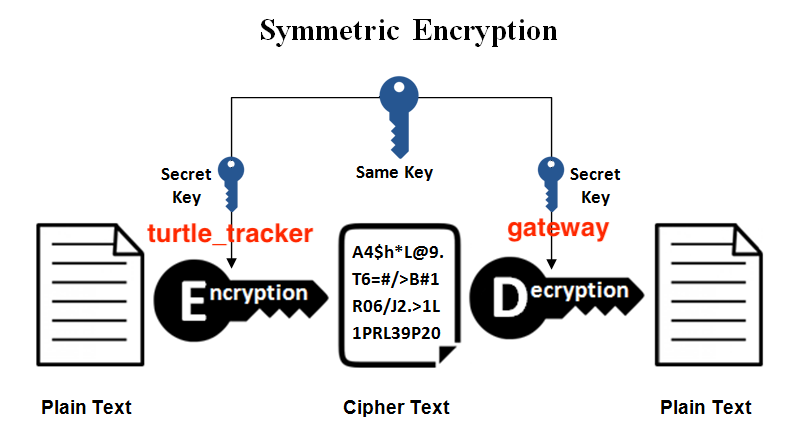
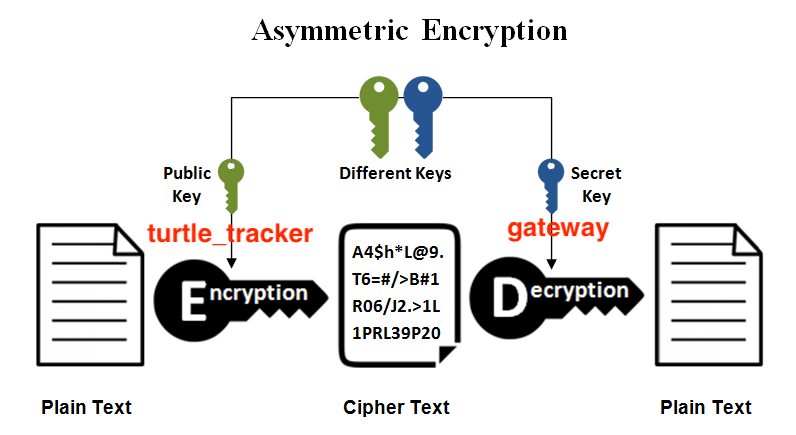
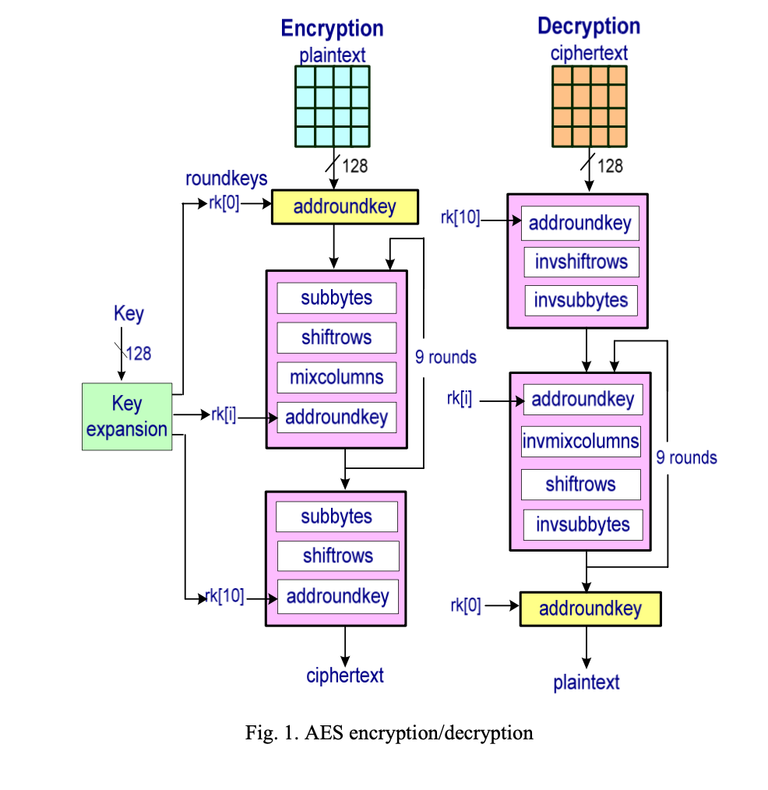

## Differences between Lora and LoraWan
 - Lora: https://forum.arduino.cc/t/lora-encryption/587754 
    - Data consists simply of a collection of bytes. The radio does not know or care whether the collection being sent is encrypted.
    - There are many different encryption libraries for Arduino. (Just pick one, learn how to use it, and encrypt the data buffer before sending it by radio. Decrypt at the other end.)
    - Encryption library document: https://rweather.github.io/arduinolibs/crypto.html 
    - Encryption library src: https://github.com/rweather/arduinolibs 
 - LoraWan: 
    - Architecture: https://lora-alliance.org/about-lorawan/ 
    - Security implementation (AES 128 bits): https://lora-alliance.org/resource_hub/lorawan-is-secure-but-implementation-matters/

## Security requirements:
 1. No one can receive our data (if received, cannot decrypt)
    - Solution: any encryption (either symmetric or asymmetric) solves this problem
 2. If someone physically gets the tracker, they will get the key stored in the tracker, therefore we should not store the key (plaintext) in the tracker 
    - Candidate solution: no good solution for now, but it's a little impossible that someone could get a tracker and try to decode it.
 3. No one can send us faked data 
    - This issue only exists when the asymmetric algorithm is selected
    - Candidate solution: use serials number to distinguish unique hardware (e.g. by using some hardware id that are globally identified)
    - Note: currently, the `id` is hard coded in the source code (different source codes) 

## Analysis
 - AES is symmetric encryption. LoranWan officially uses AES 128 bits to secure Lora physical layer.
 -   
 (src: https://www.ssl2buy.com/wiki/symmetric-vs-asymmetric-encryption-what-are-differences)
 -   
 (src: https://www.ssl2buy.com/wiki/symmetric-vs-asymmetric-encryption-what-are-differences)
 - The main constrains of selecting an encryption method should be the **energy cost** and **memory usage** in the encryption stage (where both the battery and memory is limited), so we need an algorithm that makes sure the above 3 security requirements with the least time and space comlexity.

## Unfinished tasks: 
 - Check if some components of Moteino (the board using LoRa) has a unique MAC address/encryption module. (e.g. the GPS module has a unique id?)
 - Check if there's some implementation of Diffie–Hellman in Arduino.
 - Moteino datasheet:  
 https://ww1.microchip.com/downloads/en/DeviceDoc/Atmel-7810-Automotive-Microcontrollers-ATmega328P_Datasheet.pdf 

## Dr. Jelle's suggestions: 
 - For turtle trackers, we don't care if someone sees the history of a tracker, so symmetric.
 - For water sensor: we want long-term privacy, so asymmetric.
 - Diffie–Hellman in Arduino (search in Google)
 - SSL in C: https://bearssl.org/

## Useful implementation hints:
 - Diffie–Hellman for bi-direction communication between tracker and gateway.
    - tracker -> gateway: to send the data 
    - gateway -> tracker: to see if the tracker is still alive, remotely configure the setting
 - A helpful article about security in Arduino: https://blog.arduino.cc/2020/07/02/arduino-security-primer/

## Current chosen solution
- Tturtle trackers: automatically generate the key (Diffie–Hellman), and then combine that key with AES 128 to finish the encryption.
  -   
  (src: https://www.practicalnetworking.net/series/cryptography/diffie-hellman/)
  -   
  (src: https://www.researchgate.net/figure/llustrates-the-encryption-decryption-rounds-of-the-AES-128-The-cipher-maintains-an_fig1_274027061)
 - Water sensor: to avoid the gateway storage to be hacked, an asymmetric algorithm must be used. (e.g. by using the `SSL` library in C)
