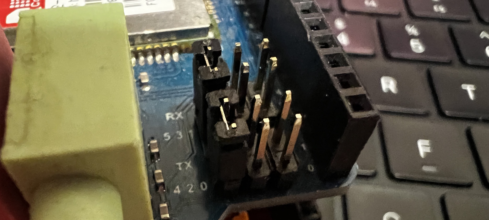
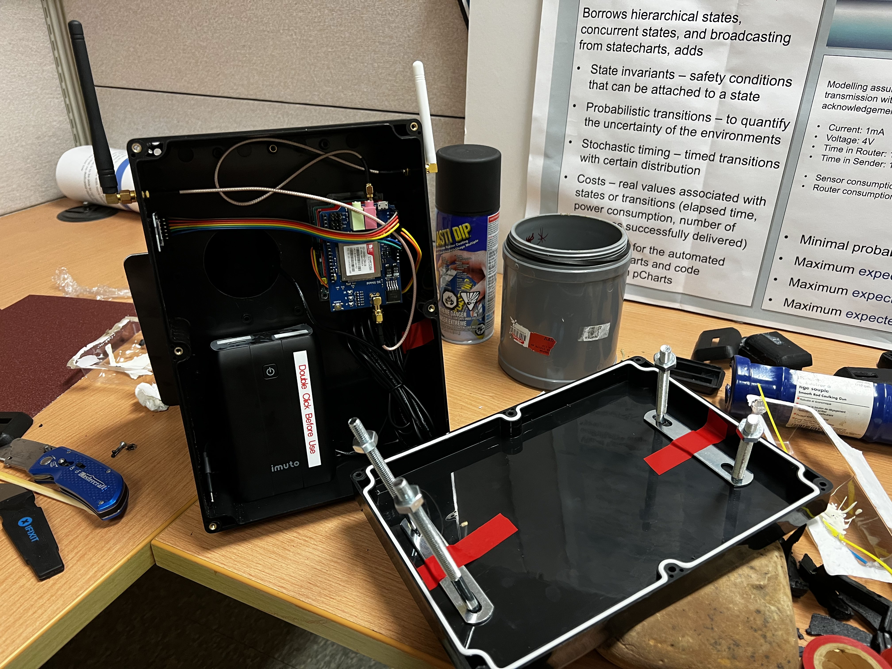

# Gateway Assembly

## Hardware Assembly

(Gateway Image)

**LoRa Shield:**

- Attach LoRa shield to Arduino Uno

**Tinysine 3G Shield:**

- Bend pin 8 and connect to A1
- Bend pin 9 and connect to A0
- Attach 3G shield to Arduino Uno
- Connect Tx to Arduino D4
- Connect Rx to Arduino D5

(Bended pin image)

**SD Card:**

- Connect `MISO` Pin to A2
- Connect `MOSI` Pin to A3
- Connect `SCK` Pin to A4
- Connect `CS` Pin to A5
- Connect Vcc Pin to Vcc
- Connect Ground Pin to Ground

## Configure Tinysine 3G Shield

[3G Shield Set Baud](./3g_shield_setbaud/README.md)

## Flash firmware

Move `../Arduino_Code/Library/libraries` to Arduino Library folder

- Mac: ~/Documents/Arduino/libraries/
- Windows: /Users/{username}/Documents/Arduino/libraries/

Flash with Arduino IDE

## Enclosure

 

