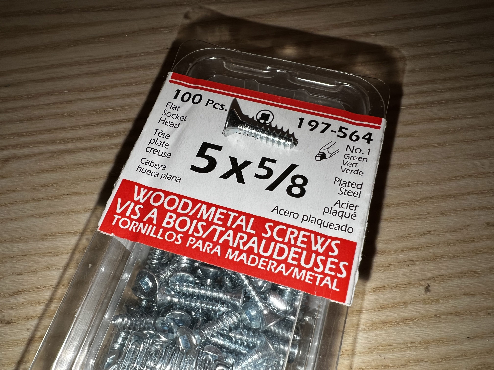
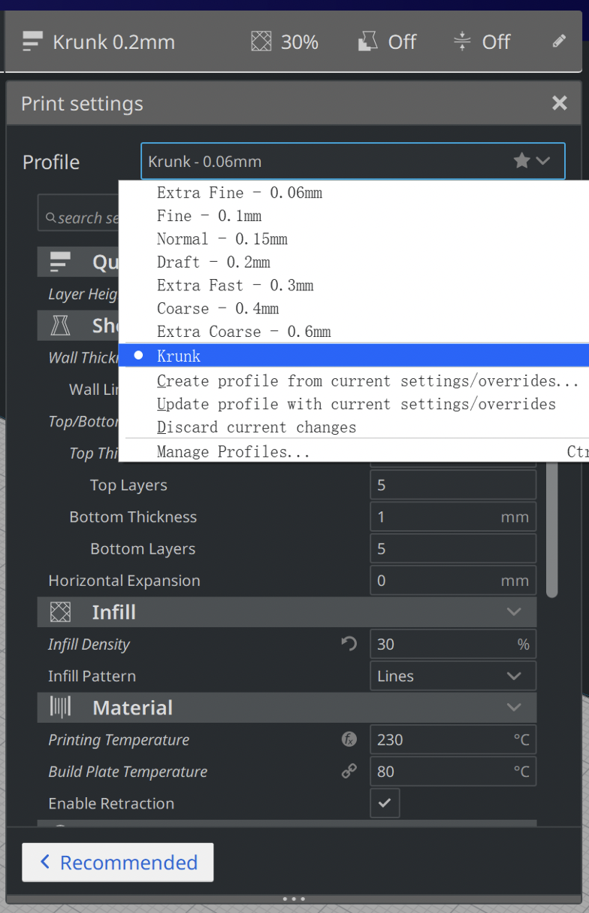

# 3D Printing - Turtle Tracker Enclosure

## Overview

This document explains how to 3D print Turtle Tracker Enclosure by Anycubic Kobra (Other 3D printers may needs to use different profiles).

If you do not want to modify the enclosure model, skip to part 5.

## Preparation

- Anycubic Kobra
- PETG Filament
- #5x5/8 Screws with Flat Socket Head

## 1. Download Autodesk Inventor

[Autodesk Inventor](https://www.autodesk.com/products/inventor/overview)

Students and educators can get educational access to Autodesk Inventor. [Autodesk Educational Access](https://www.autodesk.com/education/edu-software/overview)

## 2. Open project in Inventor

Open `.iam` project file

Select `File` - `Output` - `CAD File` - Choose `.stl` format

## 3. Download and config Cura slicing software

#### Download

[Cura](https://github.com/Ultimaker/Cura/releases)

#### Config

Open Cura installation Folder

Windows version default location: `C:\Program Files\Ultimaker Cura <version>`

- Version 4.x
  Copy the folder `~/Printer Profile/resources` into the installation folder `Ultimaker Cura <version>/resources`

- Version 5.x
  Copy the folder `~/Printer_Profile/resources` into the installation folder `Ultimaker Cura <version>/share/cura/resources`

Open Cura and choose `Anycubic Kobra` printer with `Generic PETG` Filament

Click `Preferences` on the top bar, select `Configure Cura...`

Click on `Profiles`, then import `Printing_Profile/krunk.curaprofile`

## 4. Slice the model

Click `open` on the top left corner and select the stl file we generated in Inventor.

Align the models, and make sure there is some space between them.

Select the profile we just imported

Click `slice` then `Save to file`

## 5. Copy gcode to SD card

Once sliced the model, a gcode file will be generated.

If you are not updating the model, use the `.gcode` file under `./Turtle_Tracker_Enclosure` folder

Copy the file into a MicroSD card

## 6. Start printing

[Kobra Manual](https://gitlab.cas.mcmaster.ca/re-mote/arduino-motes/-/blob/master/Turtle_Trackers/Docs/3D_Printed_Enclosure/Kobra_Manual/User%20Manual/Anycubic%20Kobra_User%20Manual_20211227_V0.0.1.pdf)

- Leveling: page 25 - 27
- Loading Filament: page 28 - 31
- Printing Models: page 32
