# Tracker Assembly

## Hardware Assembly

Cut GPS cable

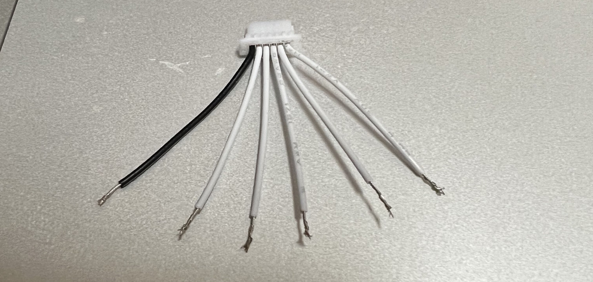

Cut power cable

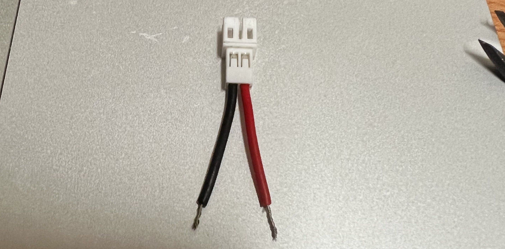

Get all parts ready

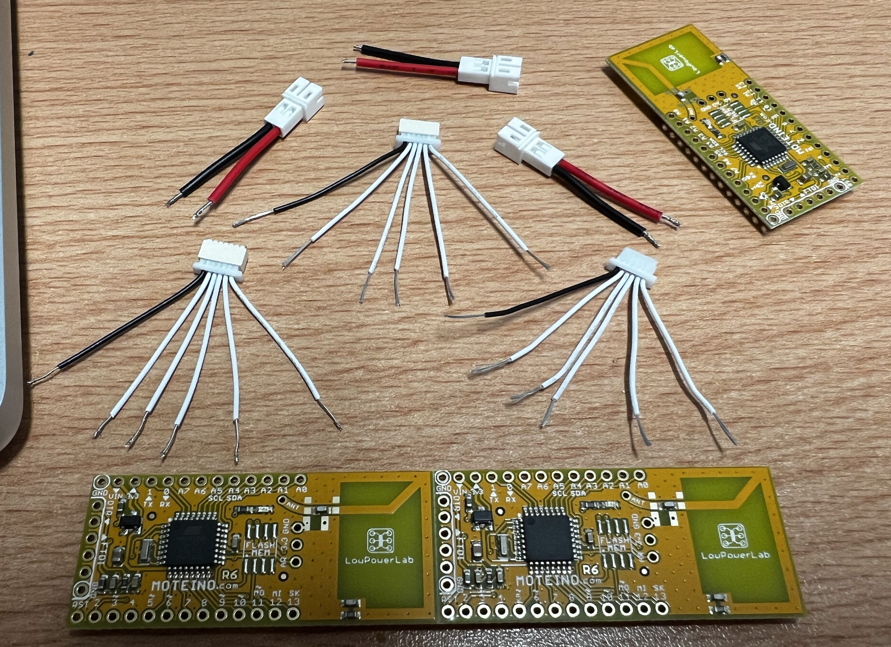

Connect the cable to moteino and solder in place

**GPS ([Manual](./manual/GP-735T-150203.pdf)):**

- Connect GPS pin 6 to D6
- Connect GPS pin 4 to D4
- Connect GPS pin 3 to D3
- Connect GPS pin 2 to Vin / PWR
- Connect GPS pin 1 to Ground

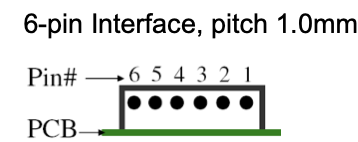

Check with your battery if your battery has reversed Vcc and Ground, the power cable should also be reversed, in this case, the cable is reversed

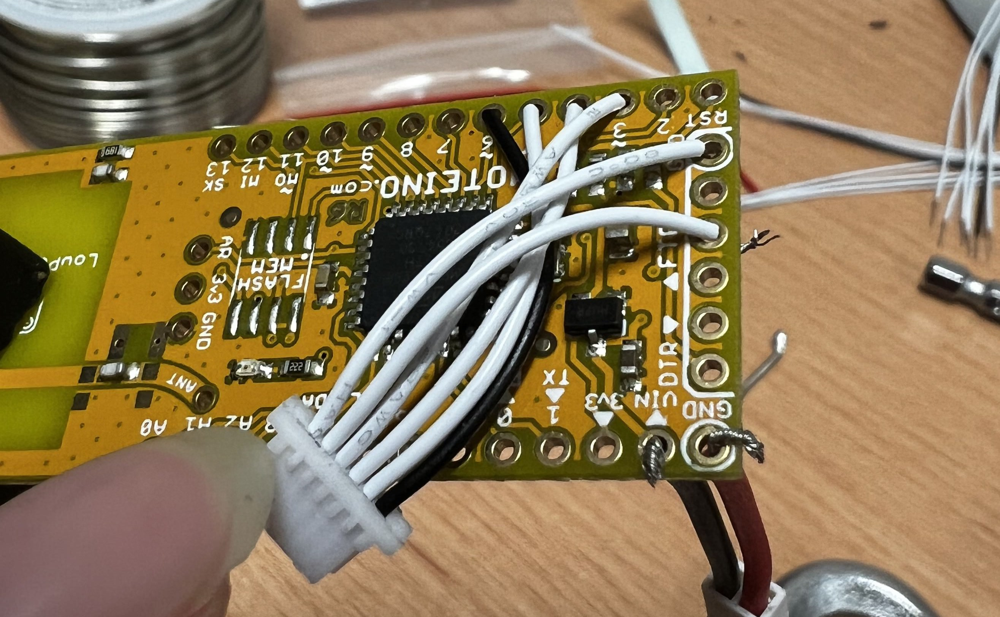

## Flash firmware

Connect TX, RX, Reset, and power cable to moteino

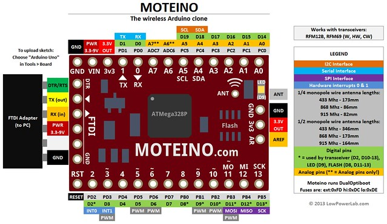

 

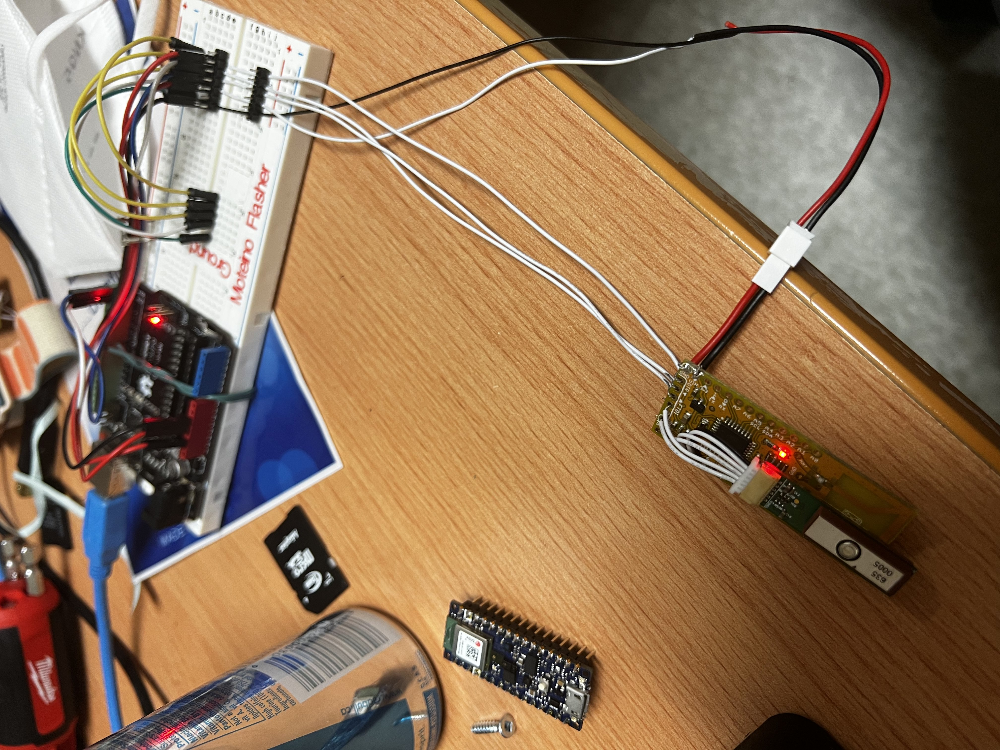

Install the `Moteino AVR Boards` package in Arduino IDE: [Programming & Libraries](https://lowpowerlab.com/guide/moteino/programming-libraries/)

Move `../Arduino_Code/Library/libraries` to Arduino Library folder

- Mac: ~/Documents/Arduino/libraries/
- Windows: /Users/{username}/Documents/Arduino/libraries/

Flash with Arduino IDE

## Enclosure

3D Printed Tracker Enclosure: [Enclosure](./3D_Printed_Enclosure/README.md)

Spray `Plasti Dip` to make the 3D printing waterproof

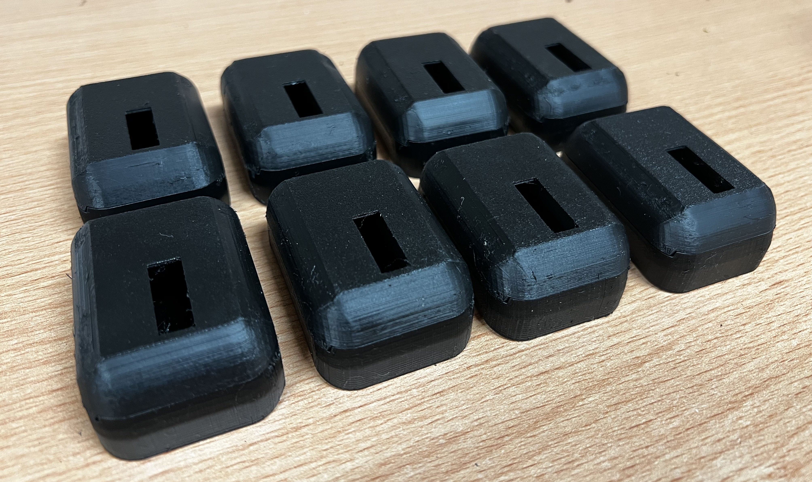

Spray `Rust Aerosol Spray Paint` to make the screws not rusted

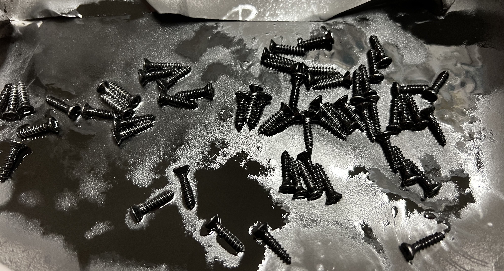

## Prepare to deploy:

Charge the batteries

Caution: The 1600mAh Battery (currently using) Vcc and Gnd are reversed.

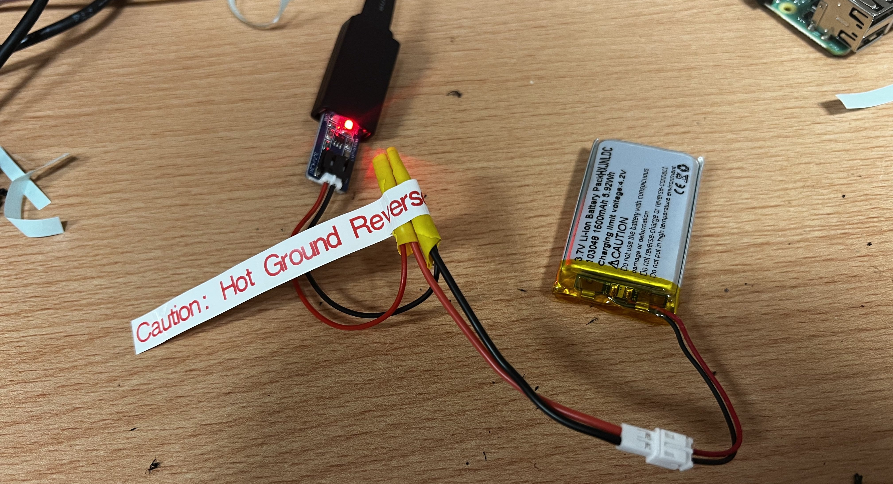

Put the moteino and battery into the enclosure

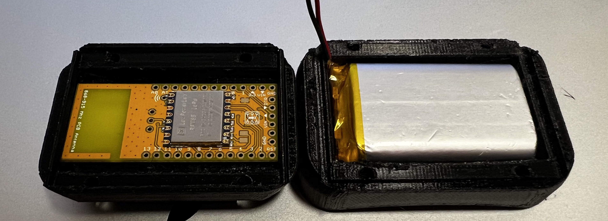

Seal the enclosure with a Gasket

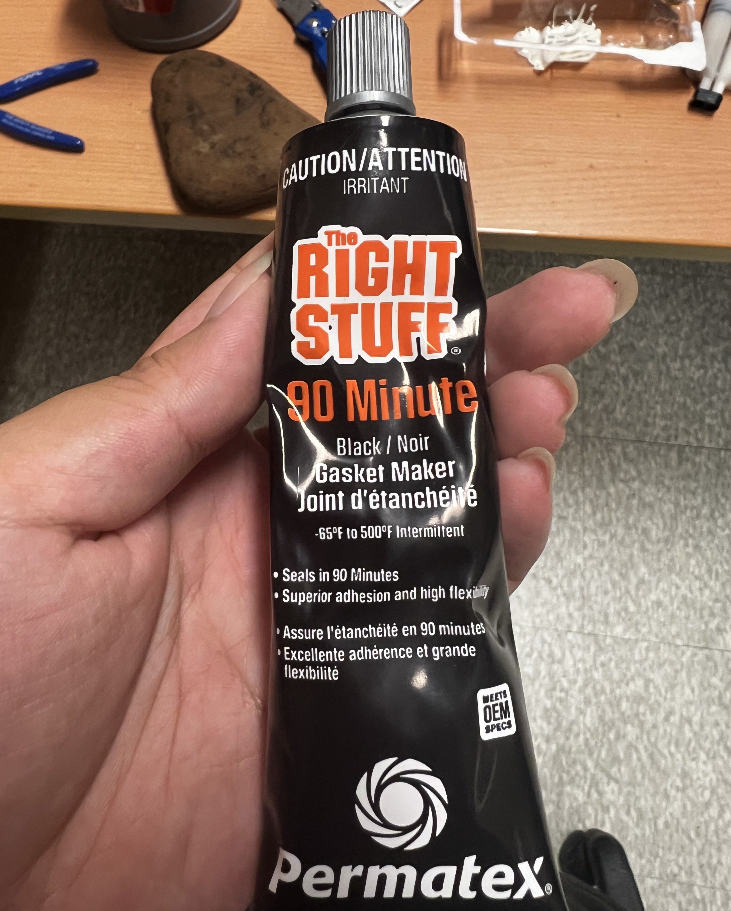

Completed Trackers

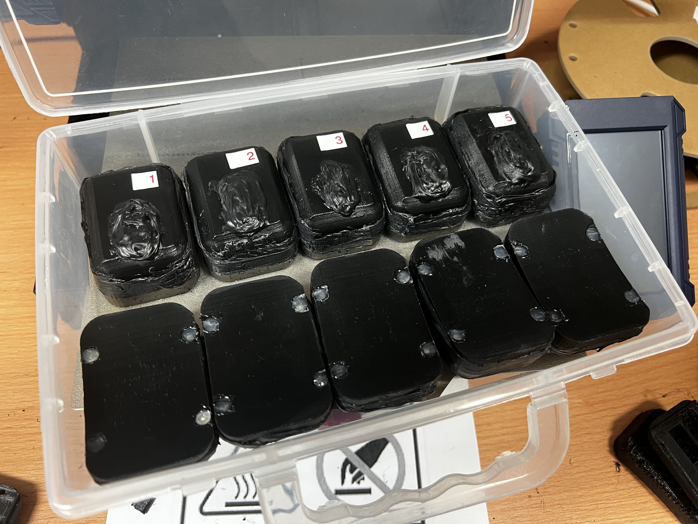
