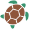

# Turtle Tracker Overview

Code used in the Turtle Tracker project, 2022 version. This version differs from the previous version located in `Node_Code.ino`.

## Arduino Code

`./Arduino_Code/Gateway_Code/` is for use with the Gateway module which consists of an Arduino UNO, LoRA shield, 3G Shield and SD Card Reader.

`./Arduino_Code/Tracker_Code/` is for use with the Turtle Tracker module which consists of a Moteino (RFM95) and GPS module.

## Documentations

 - [Hardware Specification](./Docs/Specification.md)

###### Setup:

 - [Assembly of Gateway](./Docs/Assembly_of_Gateway.md)

 - [Assembly of Trackers](./Docs/Assembly_of_Trackers.md) | [Trackers Enclosure](./Docs/3D_Printed_Enclosure/README.md)

 - [Pi Server Source Code](https://gitlab.cas.mcmaster.ca/re-mote/pi-server/-/tree/master/turtle-tracker-webserver) | [How to Setup Server](https://gitlab.cas.mcmaster.ca/re-mote/pi-server/blob/master/Documentation/RaspberryPi_Instructions.md)

###### Code:

 - [Message Format](./Docs/message_format_turtle_tracker.xlsx)
